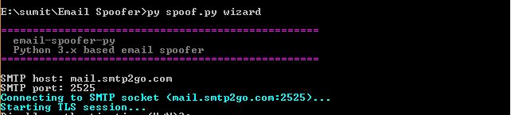
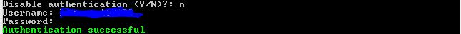
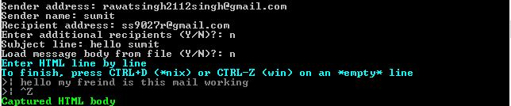
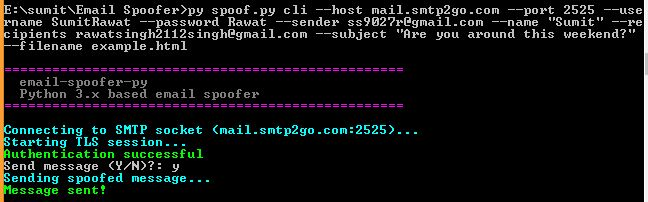

- [Getting Started](#getting-started)
- [Commands](#commands)
  - [Wizard](#wizard)
  - [CLI](#cli)
- [Result](#result)

## <a id="getting-started">Getting Started</a>

1. `$ https://github.com/Sumit24-prog/EmailSpoofing.git`
3. Activate `virtualenv`
2. `$ pip install -r requirements.txt`
3. `$ python spoof.py`

> Instructions on creating and activating `virtualenv` can be found here: https://packaging.python.org/guides/installing-using-pip-and-virtual-environments/

## <a id="commands">Commands</a>

`smtp-email-spoofer-py` offers two global commands: [`wizard`](#wizard) and [`cli`](#cli):

```bash
$ py spoof.py -h
usage: spoof.py [-h] {wizard,cli} ...

Python 3.x based email spoofer

optional arguments:
  -h, --help    show this help message and exit

commands:
  {wizard,cli}  Allowed commands
    wizard      Use the step-by-step wizard
    cli         Pass arguments directly
```    

----

### <a id="wizard">Wizard</a>

Issue the `wizard` command to use the step-by-step wizard:

```
$ py spoof.py wizard
```

1. Enter the SMTP server information to establish a connection over TLS:



2. Optionally provide credentials to login to the SMTP server:



3. Compose the forged message:

> Load the HTML message body from a file, or compose it within the shell



4. Send the message:


----

### <a id="cli">CLI</a>

Issue the `cli -h` command to view the help:

```bash
$ py spoof.py cli -h
usage: spoof.py cli [-h] (--noauth | --username USERNAME)
                    [--password PASSWORD] --host HOST --port PORT --sender
                    SENDER --name NAME --recipients RECIPIENTS
                    [RECIPIENTS ...] --subject SUBJECT --filename FILENAME

optional arguments:
  -h, --help            show this help message and exit
  --noauth              Disable authentication check
  --username USERNAME   SMTP username
  --password PASSWORD   SMTP password (required with --username)

required arguments:
  --host HOST           SMTP hostname
  --port PORT           SMTP port number
  --sender SENDER       Sender address (e.g. spoofed@domain.com)
  --name NAME           Sender name (e.g. John Smith)
  --recipients RECIPIENTS [RECIPIENTS ...]
                        Recipient addresses (e.g. victim@domain.com ...)
  --subject SUBJECT     Subject line
  --filename FILENAME   Message body filename (e.g. example.html)
```

1. Issue the `cli` command along with the appropriate arguments:

> If `--noauth` is not specified, `--username` and `--password` are required.



----

## Result


